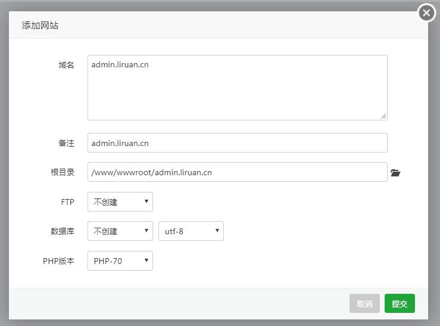

## 1. 环境要求

CentOS 6.x / 7.x。

## 2. 安装宝塔

宝塔面板是一款服务器管理软件，支持 Windows 和 Linux 系统，可以通过 Web 端轻松管理服务器，提升运维效率。[链接](https://www.bt.cn/)

```
$ yum install -y wget && wget -O install.sh http://download.bt.cn/install/install.sh && sh install.sh
```

## 3. 安装套件


## 4. 安装 PM2 管理器

PM2 是 Node 进程管理工具，可以利用它来简化很多 Node 应用管理的繁琐任务，如性能监控、自动重启、负载均衡等。[链接](http://imweb.io/topic/57c8cbb27f226f687b365636)

- 宝塔 Linux 面板 - 软件管理 - PM2 管理器 2.6.1 - 安装；
- 关闭 Xshell，重新打开；

## 5. 安装 nrm

nrm 是 npm registry 的管理工具。[链接](https://cnodejs.org/topic/5326e78c434e04172c006826)

```bash
# 安装
$ npm install -g nrm

# 使用 taobao registry
$ nrm use taobao
```

## 6. 新建网站



## 7. 配置 SSL 证书


<br><br>


## 8. 配置反向代理


## 9. 发布

```bash
# 进入项目目录
$ cd /www/wwwroot/admin.liruan.cn

# 下载代码
$ git clone https://github.com/zhaotoday/koa-mvc-framework.git

# 进入 Node 项目目录
$ cd koa-mvc-framework

# 更新代码
$ git pull

# 安装依赖包
$ npm install

$ 启动项目
$ npm start

$ 停止项目
$ npm run stop
```
